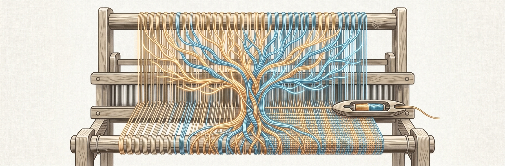

<p align="center">
  
</p>

```
▞▚▞▚▞▚▞▚▞▚▞▚▞▚▞▚▞▚▞▚▞▚▞▚▞▚▞▚▞▚▞▚▞▚▞▚▞▚▞▚

              c   o   l   o   o   m
          weaving language, together

▚▞▚▞▚▞▚▞▚▞▚▞▚▞▚▞▚▞▚▞▚▞▚▞▚▞▚▞▚▞▚▞▚▞▚▞▚▞▚
```

**coloom** is a [loom](https://github.com/socketteer/loom) where a human and an AI agent weave
*at the same time*. It's an interface for LLM **base models** — branching trees of raw completions,
with per-token logprobs — designed from the ground up for **real-time human + agent collaboration**
on one shared weave.

> [!NOTE]
> **Status: day zero.** This repo holds the design and intent; the code isn't written yet.
> The full plan lives in [`docs/PLAN.md`](docs/PLAN.md). Watch this space — or weave with us.

## The metaphor

On a loom, the **warp** threads are held in tension and the **weft** is drawn back and forth across
them; a little tool called the **shuttle** carries the weft from one side to the other, and the
crossing of the two is what becomes cloth.

That's the picture for coloom. The human and the agent are the two threads. Neither makes fabric
alone — it's the *interlacing* that does. The shuttle is the thing that passes between you: an edit,
a generated branch, a logprob someone noticed, a path taken. coloom is the loom that holds the
tension and lets you both throw the shuttle.

## The idea

- **One shared, live weave.** A server owns the canonical tree; everyone — the human in a web UI,
  an agent at a CLI — works against it and sees each other's edits the moment they happen. No file
  passed back and forth, no clobbering.
- **Base models, properly.** Nodes keep real per-token logprobs, top-k counterfactuals, token ids,
  entropy — the things you actually want when you're looming, not a flattened string.
- **Human and agent, attributed.** Every node knows whether a person or a model made it (and which
  model, with what seed) — so a co-woven tree stays legible.
- **Agent-native.** The CLI is built for an AI to drive: JSON in, JSON out, no prompts. Point your
  agent at the same loom you're sitting at and weave together.

## How it'll work

```
                       ┌─────────────────────────────────┐
                       │  server  (the loom / authority)  │
   you ── web UI ────▶ │  owns the weave · REST + events  │ ◀──── agent ── CLI
                       └─────────────────────────────────┘
                holds the canonical tree, persists it, tells everyone what changed
```

- **Backend** — Python ([`uv`](https://docs.astral.sh/uv/), FastAPI): a server that owns the weave
  and broadcasts changes over WebSocket; SQLite for storage; `httpx` for inference against any
  OpenAI-compatible `/v1/completions` endpoint with logprobs (llama.cpp `llama-server`, vLLM).
- **CLI** (`coloom`) — Python, agent-facing: `read`, `gen`, `add`, `set-active`, … as a thin client.
- **Web frontend** — TypeScript, in a sibling repo, on the same API.

See [`docs/PLAN.md`](docs/PLAN.md) for the weave schema, the build sequence, and design notes.

## Lineage

coloom stands on the shoulders of the looms before it —
[loom](https://github.com/socketteer/loom),
[loomsidian](https://github.com/cosmicoptima/loom),
[exoloom](https://exoloom.io),
[mikupad](https://github.com/lmg-anon/mikupad),
[wool](https://github.com/lyramakesmusic/wool),
[logitloom](https://github.com/vgel/logitloom) —
and especially [**Tapestry Loom**](https://github.com/transkatgirl/Tapestry-Loom), whose thoughtful
weave-format design we drew on directly. coloom's one new thread: making the loom a place two
weavers — one human, one not — can share.

## A small honesty

coloom is itself being woven by a human and an AI, together. That's not a gimmick; it's the reason
the tool exists. If the collaboration is good, the cloth shows it.

## License

[MIT](LICENSE) — use it, fork it, weave with it. (Happy to revisit if a different license serves the
project better.)
